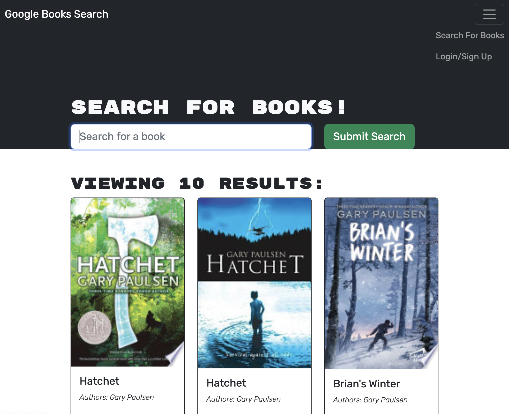

# Book Search Engine

## Description

I was given a fully functioning Google Books API search engine built with a RESTful API, and refactored it to be a GraphQL API built with Apollo Server. The app was built using the MERN stack, with a React front end, MongoDB database, and Node.js/Express.js server and API.

I set up an Apollo Server to use GraphQL queries and mutations to fetch and modify data, replacing the existing RESTful API. I then modified the existing authentication middleware so that it works in the context of a GraphQL API. Finally, I created an Apollo Provider so that requests can communicate with an Apollo Server, and deployed it to heroku

## Installation

Simply navigate to https://colins-book-search-engine.herokuapp.com/ and start searching!

## Usage

